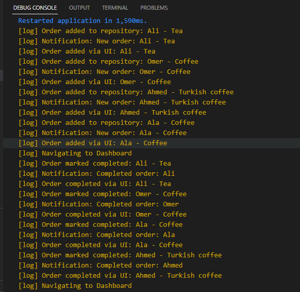

# smart_ahwa_manager

A new Flutter project.

# Smart Ahwa Manager

 is a Flutter application designed to help café owners efficiently manage customer orders, track popular items, and generate daily sales reports to optimize business operations.

---

## Features

- Add customer orders with:
  - Customer Name
  - Drink Type (e.g., Shai, Turkish Coffee, Hibiscus Tea)
  - Special Instructions (e.g., “Extra Mint, please”)
- Mark orders as completed
- View pending and completed orders
- Dashboard providing:
  - Total number of orders
  - Pending orders
  - Completed orders
  - Top-selling drinks
- Logging in terminal for order actions (add/complete)
- Built using SOLID principles and modular architecture (Repository, Service, Controller).
## Screenshots

### Home Screen

### Dashboard Screen

### CompleteOrders

### Pending Orders

### Log

## Architecture

The project follows **Clean Architecture** and **SOLID principles**:
- **SRP**: Separate classes for Repository, Service, and Controller
- **DIP**: Abstractions for repository and notification services
- **OCP/LSP**: Dashboard service can be extended without modifying existing code
- **Polymorphism & Encapsulation**: Notifications and order state management